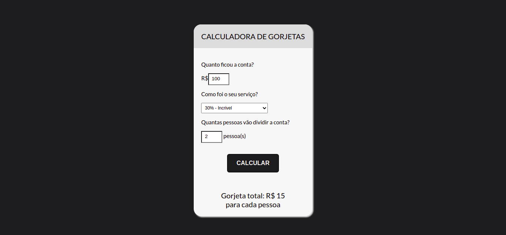

# Calculadora de Gorjetas

  <a href="#sobre">Sobre</a>&nbsp;&nbsp;&nbsp;|&nbsp;&nbsp;&nbsp;
  <a href="#tecnologias-utilizadas">Tecnologias utilizadas</a>&nbsp;&nbsp;&nbsp;|&nbsp;&nbsp;&nbsp;
  <a href="#como-rodar">Como rodar?</a>&nbsp;&nbsp;&nbsp;|&nbsp;&nbsp;&nbsp;
  <a href="#licença-e-autores">Licença e autor</a>

## Sobre

Desenvolvido com base no mine curso da base de programação do One Bit Code, que ensina a desenvolver uma simples calculadora que calcula o valor da gorjeta baseado no valor da conta e na satisfação do cliente que está associada a uma porcentagem.

### Resultado final

_Resultado:_

## Tecnologias utilizadas

Este projeto foi desenvolvido utilizando as seguintes tecnologias:

### 💻 Front-end

- [HTML](https://developer.mozilla.org/pt-BR/docs/Web/HTML)
- [CSS](https://developer.mozilla.org/pt-BR/docs/Web/CSS)
- [JavaScript](https://www.javascript.com/)

## Como rodar?

- É um site simples então basta abrir o arquivo index.html

## To do

Alguma ideia para melhorar a aplicação?

Sinta-se livre para sugerir novas melhorias e correções [criando uma issue](https://github.com/DiegoImperiano/Mecanicar/issues/new) 😉.

## Licença e autor

Este projeto está sob a licença MIT. Veja o arquivo [LICENSE](https://github.com/DiegoImperiano/calculadora-de-gorjetas/blob/main/LICENSE) para mais detalhes.

Desenvolvido por [Diego Imperiano](https://github.com/DiegoImperiano).

